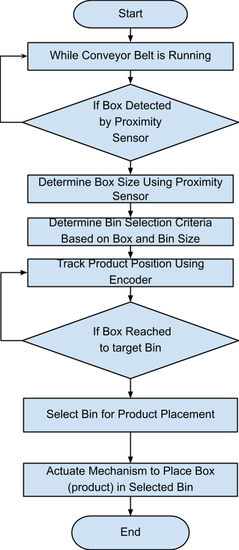

## Flow chart of Conveyor machine

**Start**

While Conveyor Belt is Running:

> If Product Detected by Proximity Sensor: Track Product Position Using
> Encoder Determine Box Size Using Proximity Sensor
>
> Determine Box Selection Criteria Based on Product and Box Size Select
> Box for Product Placement
>
> Actuate Mechanism to Place Product in Selected Box

**End**

## Sorter Conveyor Belt System Design

The following document outlines the design and functionality of the
sorter conveyor belt system, which is tasked with providing 6500
products per hour. The system utilizes two conveyor belts referred to as
"Backbone 1" and "Backbone 2" for the supply of products. Additionally,
it includes load management architecture to ensure the sorter remains
full. The system operates in two modes: "Accumulation Mode" and "Slag
Mode." Furthermore, it incorporates gap optimization functionalities to
manage forward and backward gaps in product flow.

## System Overview

The sorter conveyor belt system is designed to achieve a throughput of
6500 products per hour. This is accomplished through the utilization of
Backbone 1 and Backbone 2 conveyor belts, which supply products to the
sorter.

### Load Management Architecture

To ensure the sorter remains full and operational, a load management
architecture has to be implemented. This architecture monitors the
product flow and adjusts the supply from Backbone 1 and Backbone 2
accordingly. During the Accumulation Mode, the system actively provides
products from the backbone conveyor belts to maintain a consistent flow
into the sorter.

#### Operating Modes

a\. Accumulation Mode:

\- In this mode, the system operates to provide a continuous flow of
products from Backbone 1 and Backbone 2 conveyor belts into the sorter.

\- The load management architecture adjusts the supply to maintain
optimal sorter capacity without overwhelming it.

b\. Slag Mode:

> 5\. Gap Optimization

a\. Forward Gap:

\- To optimize forward gaps, the system increases the speed of Backbone
1 and/or Backbone 2 conveyor belts.

\- This allows products to reach the sorter more quickly, reducing gaps
in the product flow.

b\. Backward Gap:

\- For backward gaps, the system decreases the speed of Backbone 1
and/or Backbone 2 conveyor belts.

\- By slowing down the supply, the system can align products efficiently
and reduce gaps in the flow.

The sorter conveyor belt system is designed to efficiently handle a
throughput of 6500 products per hour. With the implementation of load
management architecture and gap optimization functionalities, the system
ensures consistent and optimal product flow into the sorter. The two
operating modes, Accumulation Mode and Slag Mode, allow for dynamic
adjustments to meet varying demands and optimize the sorting process.
